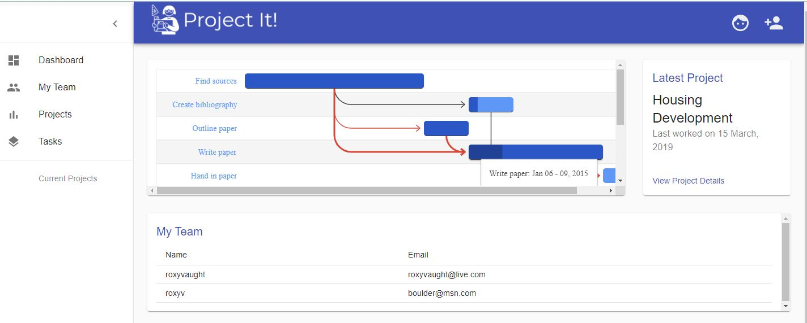
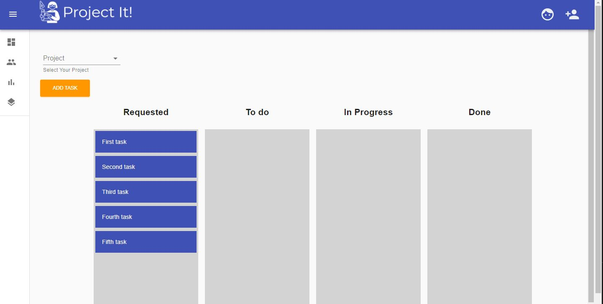

<h1 align="center">Project It!</h1>

<p align="center">
    
    
    
    
    
</p>

## Table of contents
--------------------
* [General info](#general-info)
* [Developed by](#developed-by)
* [Install](#install)
* [Testing](#testing)
* [Features](#features)

## General info
--------------------
Project It is a simple project management tool that allows you to create projects, tasks, and a team. As a project administrator, you can create tasks with deadlines and assign users to those tasks. Your tasks are then visually displayed so that you can see where they overlap and when things are due. [Visit the deployed site here](https://project-it-panda.herokuapp.com/)





## Developed by: 

* [Brent Feuerbacher](https://github.com/feuerbacherb) 
* [Terry Thompson](https://github.com/terrylthompsonintx)
* [Roxanna Vaught-Mijares](https://github.com/roxyvaught)
	
## Install
--------------------

Clone the repo to your local machine then run the following from the root directory 

```
$ npm install 
$ npm start 
```

## Testing
--------------------
No testing available at this time 

--------------------
## Features include:
* Allows login or register of new user
* A central dashboard with gantt chart, team display, and project display
* User add projects, tasks, and users 
* Tasks can be classified as Requested, To Do, In Progress, and Done
* User can log out
